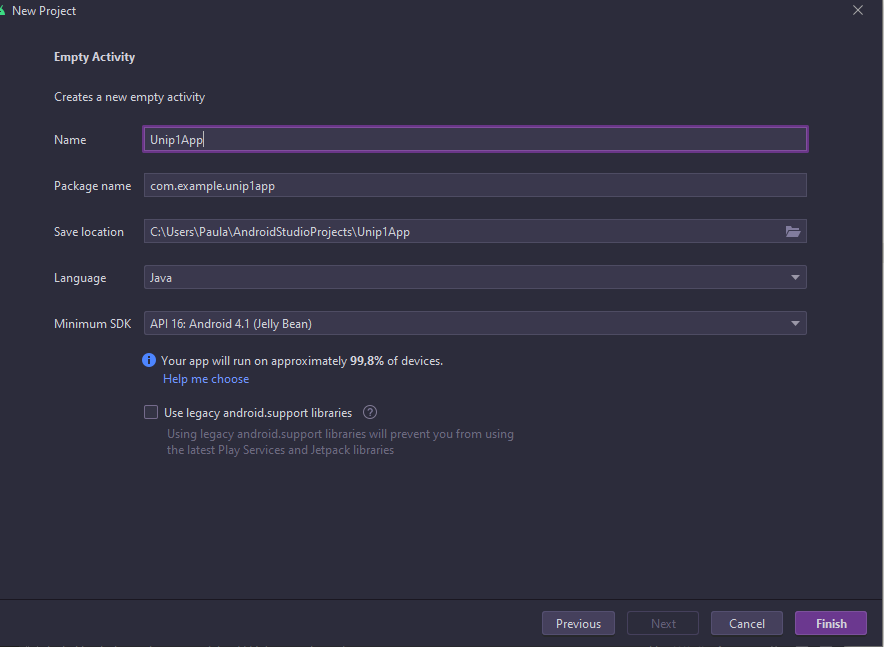

# Primeira atividade Unip Android  Java

## 1° Exiba na tela "Olá unip"



## activity_main.xml

<?xml version="1.0" encoding="utf-8"?>
<androidx.constraintlayout.widget.ConstraintLayout xmlns:android="[http://schemas.android.com/apk/res/android](http://schemas.android.com/apk/res/android)"
xmlns:app="[http://schemas.android.com/apk/res-auto](http://schemas.android.com/apk/res-auto)"
xmlns:tools="[http://schemas.android.com/tools](http://schemas.android.com/tools)"
android:layout_width="match_parent"
android:layout_height="match_parent"
tools:context=".MainActivity">

```
<TextView
    android:id="@+id/textView"
    android:layout_width="341dp"
    android:layout_height="21dp"
    android:text="Olá Unip ADS 2021-2 Prof: Shie Chen!"
    app:layout_constraintBottom_toBottomOf="parent"
    app:layout_constraintEnd_toEndOf="parent"
    app:layout_constraintHorizontal_bias="0.248"
    app:layout_constraintStart_toStartOf="parent"
    app:layout_constraintTop_toTopOf="parent"
    app:layout_constraintVertical_bias="0.126" />

<TextView
    android:id="@+id/textView1"
    android:layout_width="337dp"
    android:layout_height="17dp"
    android:layout_marginTop="32dp"
    android:text="Polo: Cidade Universitária"
    app:layout_constraintBottom_toBottomOf="parent"
    app:layout_constraintEnd_toEndOf="parent"
    app:layout_constraintHorizontal_bias="0.24"
    app:layout_constraintStart_toStartOf="parent"
    app:layout_constraintTop_toBottomOf="@+id/textView"
    app:layout_constraintVertical_bias="0.0" />

<TextView
    android:id="@+id/textView2"
    android:layout_width="265dp"
    android:layout_height="44dp"
    android:text="Primeira atividade Android            RA:F339DE4 Ana Paula Sena da Silva"
    android:textColor="@color/purple_200"
    app:layout_constraintBottom_toBottomOf="parent"
    app:layout_constraintEnd_toEndOf="parent"
    app:layout_constraintHorizontal_bias="0.13"
    app:layout_constraintStart_toStartOf="parent"
    app:layout_constraintTop_toBottomOf="@+id/textView1"
    app:layout_constraintVertical_bias="0.062" />

```

</androidx.constraintlayout.widget.ConstraintLayout>


# Sucesso 👩🏽‍💻

[2° Soma de  2 números em Java Android](img/Somar2numerosJavaAndroid.md)